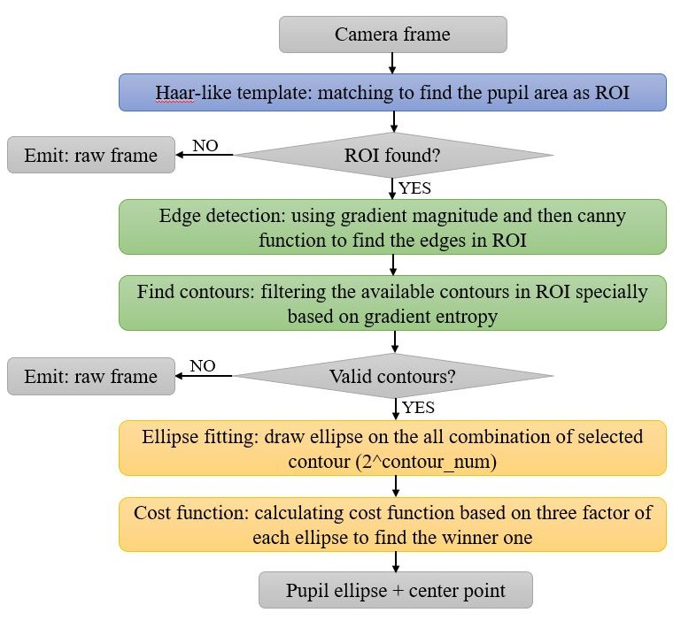

# Pupil Detection System

Real-time pupil tracking system developed in **C++ / Qt** for use in
VNG (Videonystagmography) and vHIT (Video Head Impulse Test) clinical diagnostics.

> Source code is proprietary and cannot be shared publicly.

---

## Demo

**This is the video of pupil detection**

**This is the simple result sample**

**One 4 minutes video was uploaded on aparat to be more familiar with this application.**

---

## Overview

This system performs real-time eye tracking to measure involuntary eye movements
(nystagmus) used by clinicians to diagnose vestibular disorders. The application
was developed as a desktop tool using Qt for the GUI and OpenCV for the computer
vision pipeline.

---

## Performance

**Processing speed:** **~80 FPS** real-time

**Detection method:** Classical CV, no deep learning required

**Platform:** Windows desktop (Qt application)

**Language:** C++ / Qt / OpenCV

---

## Technical pipeline

1. **Frame capture** - Live camera feed acquired at high frame rate
2. **ROI extraction** - Define a mask like pupil region, then using template matching to find the pupil area as region of interest.
3. **Edge detection** - Using Canny to detect the edges in ROI
4. **Find contour** - Finding contour of detected edges, then filtering contour specially with gradient entropy equation.
5. **Ellipse fitting** - Fit ellipses on the all combination of selected contour (2^contour_num).
6. **Cost function** - Calculating cost function, based on eccentricity, perimeter, and algebraic-error, on each ellipse to find the winner one.
7. **Output** - Pupil center coordinate and its diameter were recorded for subsequent processes in clinical tests.

---

## Clinical context

**VNG (Videonystagmography):** Records eye movements to evaluate the vestibular
system. Requires accurate real-time pupil tracking to detect nystagmus, rapid
involuntary eye movement, which clinicians use to identify inner ear disorders.

**vHIT (Video Head Impulse Test):** Measures the vestibulo-ocular reflex by
tracking eye movement in response to rapid head turns. Requires very high frame
rate capture and low-latency tracking to be clinically valid.

---

## Tech stack

- **Language:** C++
- **GUI framework:** Qt
- **Computer vision:** OpenCV
- **Target platform:** Windows

---

## Source code

This project was developed for a medical software company. The source code is
proprietary. I am happy to discuss the technical implementation in detail during
an interview.
